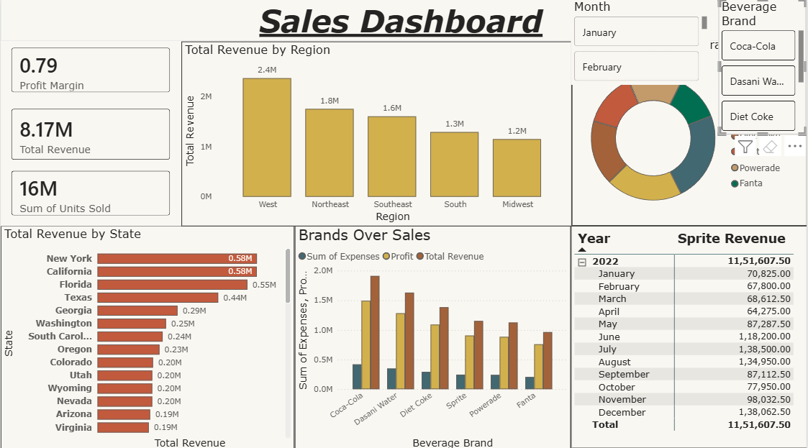

📊 Power BI Sales Analytics Dashboard

An interactive Power BI dashboard designed to analyze beverage sales across regions, states, months, and brands. This project provides clear business insights using KPIs, bar charts, donut charts, and matrix views — helping identify top-performing areas and brand profitability.

🚀 Key Insights & Features

📌 KPIs: Profit Margin, Total Revenue, Total Units Sold

🌍 Revenue by Region: West, Northeast, Southeast, South, Midwest

🏙 Revenue by State ranked by performance

🥤 Brand Performance: Coca-Cola, Diet Coke, Sprite, Fanta, Powerade, Dasani Water

📅 Monthly Sales Breakdown via Slicers

🔁 Interactive Filters: Month & Beverage Brand

💹 Visuals Used: KPIs, Bar Charts, Donut Chart, Matrix, and Category Comparison

📸 Dashboard Screenshots
🔹 Full Dashboard

🔹 Dashboard With 1 Slicer

🔹 Dashboard With Month + Brand Slicer

📂 Project Files Included
File	Description
Sales Dashboard.pbix	Power BI project file
5 Power BI Visuals Data Set.xlsx	Dataset used for analysis
/img/	Screenshot assets
🛠 Technologies Used

Power BI Desktop

Excel Dataset

Data Modeling (Star Schema)

DAX Measures

💡 Business Use Case

This dashboard helps sales teams, business analysts, and decision-makers:

Identify high-revenue regions and states

Compare beverage brand performance

Track month-wise growth and demand

Evaluate profitability through KPIs

📥 How to Use

Download the .pbix file

Open in Power BI Desktop

Load the dataset if prompted

Use slicers to explore interactive insights

⭐ If you find this helpful

Consider giving the repo a star ⭐ to support the project!
